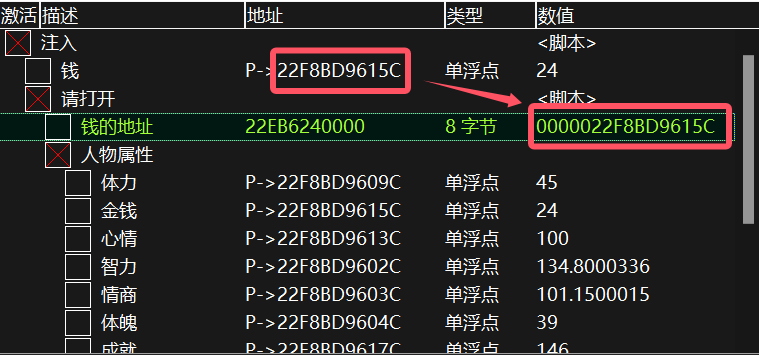

# Student-Age-Demo-Cheat-Table(SchoolDays)  
Student Age CT (School Days CT)  
学生时代:入学的CT表单  
使用方法:下载CT表后用CE打开,打开"注入"脚本,把鼠标移动到钱上,返回CE,复制钱的地址(地址),再黏贴到"钱的地址"中(值),然后打开"请打开"脚本  
(突然发现人物属性的地址会受到鹅城实验室的影响,所以暂时没办法,我是在鹅城没开,且教学模式下测试的)  
**使用时需要打开Mono功能**  
## 2024/10/13 更新  
+ 去除了繁琐的操作，现在直接修改鼠标下的数据就可以了  
+ 目前测试下来支持绝大部分可见数据  
+ 现在我已经转向BepInEx的插件开发了(就单纯学习)
## 2024/12/26
+ 其他功能可以尝试使用Bepinex开发的插件STCheat-BepInEx
# 图片教程:  

